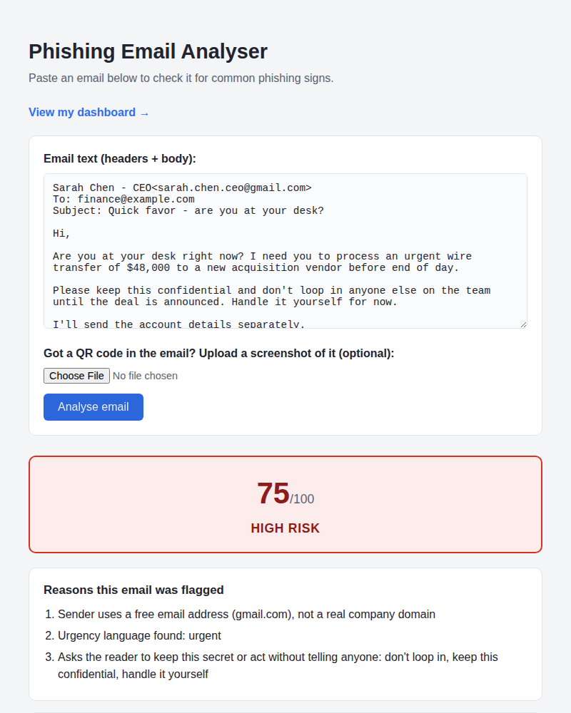
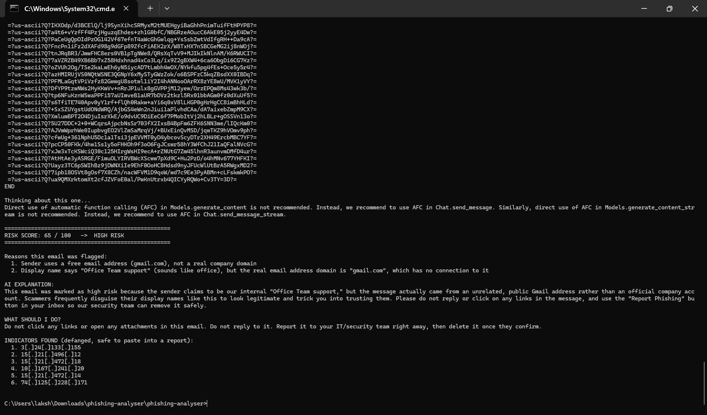
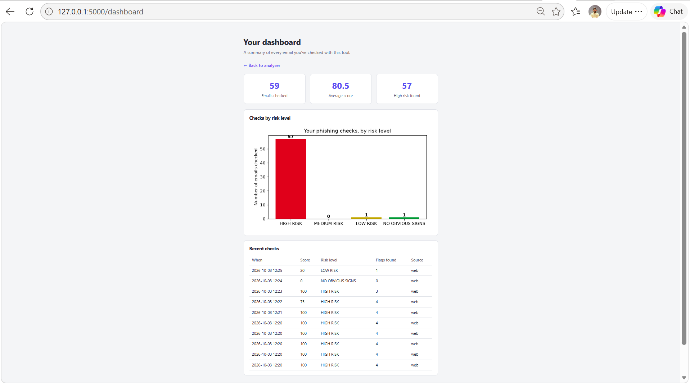
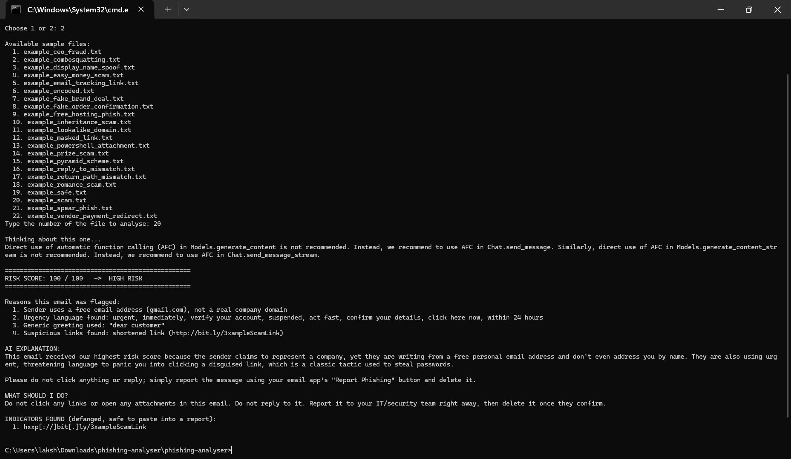
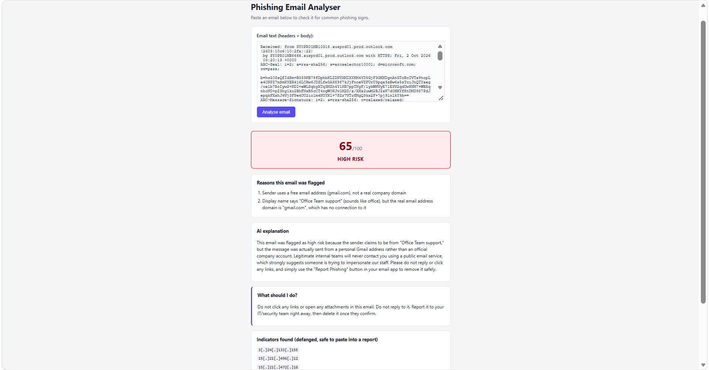
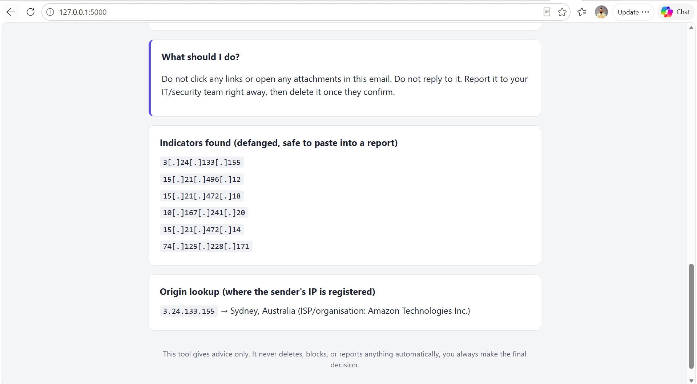
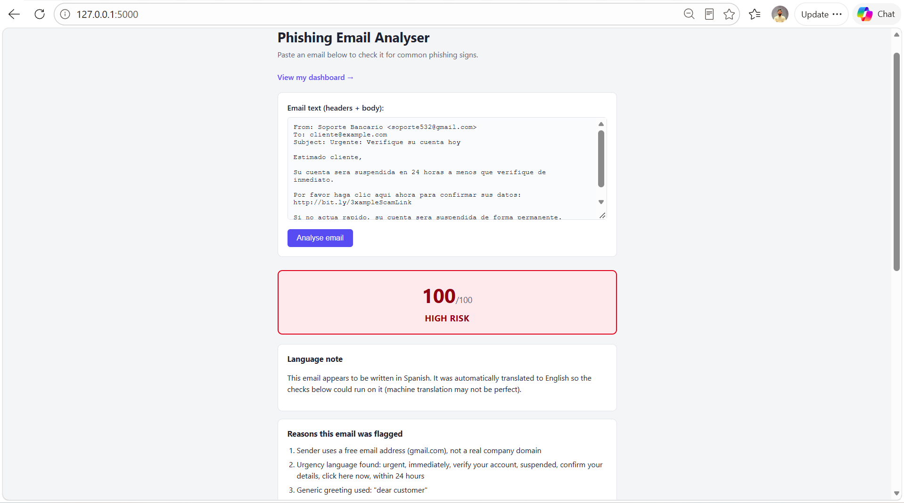
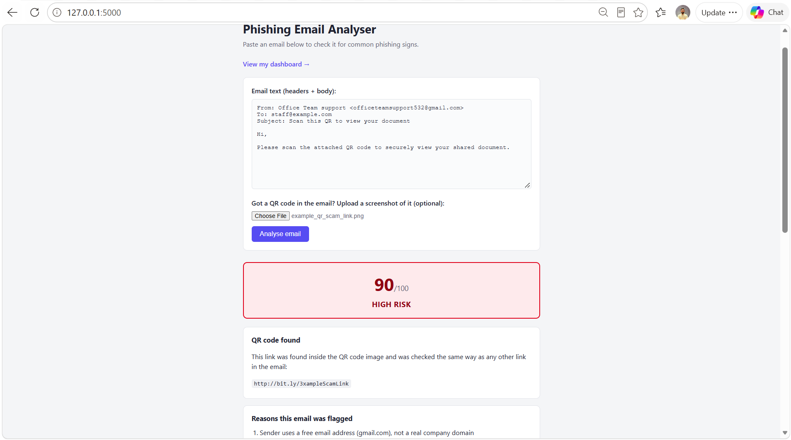

# 🎣 Phishing Email Analyser

A Python tool that checks a suspicious email for common phishing signs and
gives a risk score with clear reasons, instead of just a gut feeling.

## 📸 Screenshots

**Scanning a suspicious email, website version:**



**Scanning a suspicious email, command line version:**



**The trend dashboard, tracking every email checked over time:**



**The feedback log, a simple record of every check (no email content saved):**



**The AI explanation layer, plain-English summary of why an email is risky:**



**Domain/IP origin lookup, showing where the sender's IP is actually registered:**



**Multi-language detection, a Spanish phishing email auto-translated and still caught:**



**QR code link checking, the link hidden inside a QR image is extracted and checked:**



## 🧠 Why I built this

I received a real phishing email at work and manually investigated the
headers to confirm it was a scam. This tool automates that same process,
so the checks I did by hand can run instantly on any suspicious email.

## 🔍 What it checks right now

- Sender using a free email address (Gmail, Yahoo, etc.) while pretending
  to be a company
- Sender domain that looks like a misspelled version of a known real
  company (typosquatting, e.g. "micr0soft.com")
- Sender domain that contains a real brand name but adds extra words
  (combosquatting, e.g. "duolingo-dash.com" instead of "duolingo.com")
- Display name claims to be a known company, but the real email address
  has no connection to that company at all (display name spoofing),
  including multi-word brand names like "Home Depot" or "Best Buy", not
  just single-word brands like "PayPal"
- Common mass-phishing lure phrases ("unusual sign-in activity",
  "unclaimed package", "invoice attached", fake order/purchase
  confirmations like "order placed", "your order id", etc.)
- Urgency language ("verify immediately", "account suspended", etc.)
- Generic greetings ("Dear Customer") instead of a real name
- Requests to move the conversation to WhatsApp or a personal phone number
- Requests for passwords, PINs, bank details, gift cards, or verification codes
- Classic inheritance/advance-fee scam language ("long lost billionaire
  relative", "claim your inheritance", "unclaimed funds"), one of the
  oldest documented phishing categories, still active today
- "Easy money" / work-from-home scam language ("quit your job today",
  "guaranteed income"), used to steal money upfront or recruit victims
  as unknowing money mules
- "Miracle product" scam language ("guarantees results", evading
  regulators), common in fake health/beauty product spam
- Romance/dating scam language ("searching for their soulmate"), a
  well-documented, high-loss scam category
- Pyramid scheme / MLM recruitment language ("hidden world of...",
  "ancient secrets", "pyramid scheme"), a long-running scam category
  built around a mysterious "opportunity" rather than a fake invoice
  or account alert
- Requests for personal/family details that aren't needed (partner's name,
  children's details, date of birth, next of kin), a common tactic in
  prize/competition scams used to harvest personal information
- Secrecy language ("don't tell anyone", "handle it yourself", "keep this
  confidential"), a key tactic in CEO fraud / Business Email Compromise,
  which stops the victim from checking with a second person
- Requests to redirect a payment to new/updated banking details, the
  single costliest real-world phishing pattern for businesses (vendor
  invoice fraud), different from a normal password-phishing email
- Mentions of risky attachment file types (.exe, .scr, .js, macro-enabled
  Office files like .docm/.xlsm, .iso, Windows scripting files like
  .ps1 PowerShell, .vbe, .wsf, .hta, etc.)
- A password given to open a protected ZIP/RAR file, a real technique to
  stop antivirus and email scanners from inspecting what's actually
  inside the file before you open it
- Suspicious links (shortened links, raw IP addresses instead of a website name)
- "Reply-To" address that doesn't match the "From" address, so a reply goes
  somewhere different to where the email claims to be from
- "Return-Path" header that doesn't match the "From" address, a technical
  sign the email wasn't actually sent by who it claims to be from
- Masked links in HTML emails, where the visible link text names one
  website but the real link goes somewhere else entirely
- A link containing your own email address as a tracking parameter
  (e.g. `?email=you@example.com`), confirms your email is real just by
  clicking, even before you type anything
- Links hosted on free subdomain services (Google Sites, Blogspot,
  Glitch, Netlify, etc.), sometimes abused to host fake login pages
  because the main domain looks trustworthy
- Failed SPF / DKIM / DMARC authentication, if present in the headers
- Automatically decodes encoded email text (quoted-printable/base64) before
  checking it, so real pasted emails work correctly, not just plain text

## 🗂️ Feedback log (v4)

Every time you analyse an email (command line or website), the tool saves
one short record into `feedback_log.csv`: the date/time, the score, the
risk level, how many rules were triggered, and whether it came from the
command line or the website. It does NOT save the email content itself,
only these numbers, so using the tool never builds up a pile of other
people's email content on your computer. This is the history the trend
dashboard (coming next) will read from.

## 📊 Trend dashboard (v4)

On the website version, click "View my dashboard" to see a summary of
everything you've checked: total emails checked, average score, a bar
chart of how many fell into each risk level, and a table of your 10 most
recent checks. This reads from the feedback log above, built with Python
(`matplotlib`), no separate dashboard tool needed.

## 🔳 QR code link checking (v4)

Scammers sometimes put a QR code image inside an email instead of a normal
clickable link, specifically because most security tools (and most
people) only read the text of an email, not a picture inside it. On the
website, there's now an optional "Upload a screenshot of it" box under the
email text box. If you upload a QR code image, the tool reads the link
hidden inside it and checks that link the exact same way as any other
link in the email (shortened links, raw IP links, etc), so a QR code
can't be used to sneak a bad link past the checks. On the command line,
it asks if you want to check a QR code image file after you give it the
email. There's a test QR code (pointing to the same placeholder scam link
used in the other sample emails) in `sample_emails/qr_codes/`.

## 🌐 Multi-language detection (v4)

Every phrase rule in this tool (urgency language, generic greetings, etc)
is written in English. That means a phishing email written in another
language would normally score 0 and look "safe", even though a native
speaker would recognise it instantly. To fix that, the tool now detects
which language the email is written in (works fully offline, using
`py3langid`), and if it isn't English, automatically translates a copy
to English first (using the free Google Translate web service) so the
same phishing checks can still catch it. A "Language note" appears at
the top of the report explaining what happened. If translation isn't
available right now (no internet connection, for example), it says so
plainly and falls back to checking the original text, it never crashes.

## 🌍 Domain/IP origin lookup (v4)

If the email's headers contain a real public IP address (for example in a
"Received:" line), the tool looks up roughly where that IP is registered:
which country/city, and which ISP or hosting company owns it. This uses
the free [ip-api.com](http://ip-api.com) service, no account or API key
needed. Private/internal IPs (like `10.x.x.x` or `192.168.x.x`) are
automatically skipped, since they only mean something inside a company's
own network, not out on the public internet. If there's no internet
connection, or the lookup fails for any reason, this section is simply
left out of the report, it never stops the rest of the analysis from
working.

## ✅ "What should I do?" recommendation

Below the AI explanation, the tool also prints a plain-English "what should
I do next" line based on the risk level, the same pattern used by real
email security tools (e.g. Barracuda Sentinel, Microsoft Defender) when
they alert a user. This tool only gives advice, it never deletes, blocks,
or reports anything by itself, a human always makes the final decision.

## 🤖 AI explanation layer

After the rule checks run, the tool sends the flags and score to Google
Gemini (free tier available, no card required to get started) to write a
short, plain-English summary of why the email was risky. If no API key is
set up, it automatically falls back to a built-in template explanation
instead, so the tool still works either way.

To turn on the real AI explanation:
1. Get a free API key from https://aistudio.google.com/apikey
2. Set it as an environment variable named `GEMINI_API_KEY` on your computer
3. Install the library: `pip install google-genai`
4. Run the tool as normal, it will automatically pick up the key

## 🧪 Indicators of Compromise (IOC) extraction

Real security analysts don't leave a suspicious link as a normal clickable
link in their notes, someone could click it by accident later. Instead
they "defang" it (e.g. `http://evil.com` becomes `hxxp[://]evil[.]com`),
still readable, but safe to paste into a report or share with a colleague.
This tool automatically extracts and defangs every link and IP address it
finds, printed at the end of the report.

Each check lives in its own function in `rules.py`, so new checks can be
added without touching the others. Every rule here is based on a
documented, real phishing indicator, drawn from recognized sources (CISA
and SANS phishing guidance, TryHackMe's Phishing Analysis module, and
real breach write-ups such as the 2025 BEC fraud cases), not invented
patterns.

## ▶️ How to run it

### Install the requirements (needed for both options below)

1. Make sure Python 3 is installed
2. Open a terminal in this folder
3. Run:
   ```
   pip install -r requirements.txt
   ```
   This installs everything the tool needs in one go (Flask for the
   website, matplotlib for the dashboard, and the rest).

### Option A: command line

1. Run:
   ```
   python main.py
   ```
2. Choose option 2 to test it on the included sample emails, or option 1
   to paste in a real email

### Option B: web page (recommended)

1. Run:
   ```
   python app.py
   ```
2. Open the link it prints (`http://127.0.0.1:5000`) in your browser
3. Paste an email in and click "Analyse email"

Both options use the exact same detection engine (`rules.py`), just a
different way of entering the email and viewing the result.

## 📁 Project structure

```
phishing-analyser/
├── main.py            # command-line version - handles input and prints the report
├── app.py              # web page version (v3) - same engine, browser interface
├── templates/
│   └── index.html       # the web page's HTML
├── static/
│   └── style.css         # the web page's styling
├── rules.py            # every phishing check, each as its own function
├── decode_utils.py     # decodes encoded/MIME email text into plain text
├── ioc_utils.py         # extracts and defangs suspicious links/IPs
├── ai_layer.py          # sends flags to Gemini AI for a plain-English explanation
├── feedback_log.py      # saves a short record of every check (v4)
├── dashboard.py         # builds the trend dashboard stats and chart (v4)
├── ip_lookup.py         # looks up where a sender's IP is registered (v4)
├── language_utils.py    # detects language + translates non-English emails (v4)
├── qr_utils.py          # reads links hidden inside QR code images (v4)
├── sample_emails/       # test emails, one per pattern the tool detects
│   └── qr_codes/         # test QR code images
├── requirements.txt     # extra libraries to install
└── README.md
```

## 🗺️ Roadmap

- [x] v1: rule-based detection engine
- [x] v2: AI layer that writes a plain-English explanation of the result
- [x] v3: simple web page instead of the terminal
- v4:
  - [x] staff feedback log
  - [x] trend dashboard
  - [x] domain/IP origin lookup
  - [x] multi-language detection
  - [x] QR code link checking

All planned features are now built.

## 🔒 Note on the real email used during development

The real phishing email that inspired this project is not included here.
The sample files use made-up names and a placeholder link to demonstrate
the same patterns without exposing real company or personal details.
